# Outcome Engine

**Supplier intelligence with evidence and approved actions.**

The first working module of an enterprise data-to-outcome framework. Import supplier and invoice CSVs, inspect proposed supplier groups, calculate exact spend by currency, and stage an approved supplier sync to a local portal or a separate mock ERP through REST or a headless browser.

The core runs on a laptop with Python 3.10+ and no extra packages, GPU, API key or cloud account. Browser execution optionally adds Node.js and Playwright. Factual summaries optionally use an already installed local Ollama model. Resolution remains governed by deterministic rules and the explicitly configured classifier; no newly trained LLM is bundled.

## New in v0.8

Real-extract preparation now profiles and maps delimited or optional Excel files into the strict importer, preserves source-prefixed IDs and local extras, and binds reviewed mappings to approval snapshots. Placeholder/reused authority IDs are blocked, generic supplier names no longer capture spend queries, conflict reviews name the failing pair, and dashboard candidates are paged with true totals. Operational audit events now have a verifiable hash chain and exportable checkpoints.

Read the [v0.8 source preparation and correctness guide](docs/source-adapter-v08.md) for commands, migration, privacy and monetary limits. The adapter refuses lossy rounding and treats SAP tax fields as associations unless an explicit verified mapping says otherwise. Existing v0.7 execution and RBAC boundaries remain in place.

## New in v0.7

**Bounded execution recovery** quarantines exhausted jobs after three grants, persists investigation evidence and sends reference-only Redis dead letters. **Operational retention** archives old verified queue/outbox rows before deleting them, preserving approvals and destination idempotency. **Clock-safe grants** use coordinator/destination-owned monotonic expiry; workers never interpret local-clock deadlines.

Opt-in **dashboard RBAC** separates stewards, approvers and investigators, requires a different action author/approver, and protects data exports. Each tenant uses separate process/database/ERP credentials. **HashiCorp Vault / Azure Key Vault references** resolve credentials without file fallback; an optional vault-managed bank-linkage HMAC key pseudonymizes hashes at ingestion. These controls harden a local sandbox; they do not constitute a deployed shared SaaS or full-database encryption.

Start with the [v0.7 access, recovery and vault guide](docs/security-v07.md), including protected-demo commands, migration rules and the tested boundaries. The original two-minute demo below remains explicitly unsecured and loopback-only.

## Included from v0.6

**API-native mock ERP execution** uses approved JSON, an idempotency key, source preconditions and an independently reloaded receipt. **Detached workers** consume through authenticated HTTP without opening the coordinator's SQLite file or holding its lock during network execution. Optional **Redis Streams** delivery adds consumer groups, pending-job recovery and a transactional outbox; messages contain job references only.

Start `serve --api-erp` and a separate `worker` process. For DOM workers use `serve --browser-erp --distributed`. Read the [v0.6 setup and execution guide](docs/execution-v06.md) for commands, Redis configuration, crash recovery and destination fencing limits. These are working local adapters, not SAP Ariba/Coupa integrations or a deployed multi-host service.

## Included from v0.5

**Explain this group** now shows a two-sentence summary of legal identity evidence and measured similarities. An optional local model selects validated fact IDs; it cannot invent prose, change a match decision or authorize an action. Snapshot-bound summaries persist in the audit history with explicit fallback when Ollama is unavailable.

`serve --browser-erp` starts a separate mock ERP and a durable headless browser queue. **Approve & run browser** binds approval to the exact payload, source evidence, dataset and ERP instance. The worker signs in, navigates indexed DOM controls and submits the approved form. Completion requires a reloaded receipt and actual destination verification; retries recover existing receipts without submitting again.

Read the [v0.5 execution guide](docs/execution-v05.md) for browser setup and factual summaries. This is an original bounded DOM adapter inspired by Jev's methodology, with no paid API dependency or general-purpose swarm claim. Real vendor authorization and enterprise deployment remain future work.

## Corporate governance from v0.4

Corporate identity governance now requires a consistent clique of shared registration IDs or LEIs. Shared VAT numbers, bank hashes and postcodes generate candidates but cannot establish identity. Parent/subsidiary links remain associations. The synthetic demo now produces **eight entities** with the same spend totals.

Dashboard reviews feed an append-only training evidence table in the same transaction. `python -m enterprise_ai train --from-reviews` fits supplier-domain coefficients and a separate calibration layer using locked train/validation/calibration/test cohorts; it refuses insufficient labels and does not activate weights. Calibrated estimates use 0.75/0.99 policy tiers, with conflict checks and no model-only merges. Indexed two-hop relationship lookup and constrained two-sentence audit rationales are also available.

The new [corporate governance and learning guide](docs/governance-v04.md) includes commands, migration details and limitations. A bounded GLEIF benchmark recovered **134/155 alias pairs during retrieval**, but only **15/155 at the current scoring threshold**, demonstrating why supplier evidence and domain calibration are still needed. No production supplier model, trained LLM or cloud deployment is claimed.

## Historical v0.3 experiment

An optional **trained logistic pair classifier** now uses twelve matching features, with disjoint entity splits, validation-selected review thresholds, domain/configuration checks and model-bound audit evidence. Training needs optional NumPy; inference needs no additional packages. On a separate synthetic person test set it recovered 142/142 matches versus 97/142 for weighted scoring, with eight false positives (94.67% precision). It missed the 95% precision target and is **not deployed on suppliers**.

Read the [v0.3 training and evaluation guide](docs/pair-model-v03.md) and [experimental model card](models/README.md). The default app remains deterministic, and there is no trained LLM. Human reviews and action approvals remain required.

## Included from v0.2

Soundex and character N-gram retrieval now feed independent multi-feature scoring. Evaluated pairs and human decisions have persistent, separate audit tables, with near-miss retention and bounded blocking-miss sampling. The dashboard can review previous runs. An optional **real dbt/DuckDB gate**, supervised calibration CLI, Azure DevOps pipeline and Fabric notebook prepare the next deployment stage.

Start with the [v0.2 implementation guide](docs/resolution-v02.md), [measured benchmarks](docs/benchmark-results.md), and [enterprise deployment template](docs/enterprise-deployment.md). Default scores remain similarities, not probabilities. No supplier-trained model or cloud deployment is claimed.

## Try it in two minutes

```sh
git clone https://github.com/vishalk2712/enterprise-ai-execution-framework.git
cd enterprise-ai-execution-framework
python -m enterprise_ai serve --demo
```

On Windows, use `py` instead of `python` if that is your installed Python launcher. Open **http://127.0.0.1:8765**. Stop with Ctrl+C.

1. Inspect the sample's 10 supplier records and 8 proposed entities.
2. Ask “What is our total spend by currency?” and inspect the source citations.
3. Stage a supplier sync, inspect the payload, approve it, then execute locally.
4. Open the mock portal to verify the change, or export a Markdown handover report.

The synthetic sample has 12 invoice rows: one exact duplicate is excluded, leaving 11 invoices. Expected net totals are **GBP 2,950.00 · EUR 1,250.00 · USD 1,500.00**. Currencies are never added together.

`--demo` replaces the imported dataset in the selected database. Use a separate database for experiments:

```sh
python -m enterprise_ai --db .outcome/experiment.sqlite serve --demo
```

## What works today

| Step | Implemented behavior |
|---|---|
| Import | Strict CSV validation; reject conflicting invoice IDs and orphan references; retain the last valid dataset after invalid input |
| Identity | Group shared registration IDs/LEIs within a country only after every pair passes direct-identity and conflict checks; tax groups and model-only matches stay separate |
| Spend | Decimal arithmetic, credit values, exact-duplicate exclusion, totals and supplier rankings per currency |
| Evidence | Source file and physical row references, dataset hashes, supplier/invoice relationships, bounded evidence excerpts |
| Questions | Transparent rules for supported identity and spend questions; no external model calls |
| Actions | Default SQLite portal or opt-in mock ERP through REST/DOM; exact approved intents, durable queue/outbox, detached HTTP or Redis workers, fenced capabilities and verified receipts |
| Interface | Local dashboard, group rationales, graph preview, persistent reviews, worker status, destination receipts and downloadable audit/report |

The distinguishing product hypothesis is the complete chain from **source row → identity decision → spend result → reviewed change → verified destination**. It needs customer testing; it is not a claim of proven market advantage.

## Bring your own CSVs

Use the dashboard's “Bring your own data” panel or the CLI. The column sets below are required, in any order. Optional supplier columns are `address`, `aliases` (pipe-separated), `lei`, `parent_lei` and `bank_account_hash` (64 hexadecimal characters). LEI checks validate format/checksum, not registry existence. Bank hashes are linkage evidence, not identity keys or encryption. Use UTF-8 and quote values containing commas or newlines.

**suppliers.csv**

```csv
supplier_id,name,country,registration_id,tax_id,postcode
S-001,Example Parts Ltd,GB,EXAMPLE-001,,AB1 2CD
```

**spend.csv**

```csv
invoice_id,supplier_id,invoice_date,amount,currency,category,description
I-001,S-001,2026-01-15,120.50,GBP,Parts,Synthetic demonstration invoice
```

- `supplier_id` must be unique; every invoice must reference an imported supplier.
- `invoice_id` is a dataset-wide key. The v0.8 source adapter creates source-system/vendor composite keys for repeated invoice numbers; use `analyze-prepared` to retain its mapping evidence.
- Country and currency fields accept two and three letters respectively; this prototype does not verify them against official registries.
- Authority identifiers are supplied assertions, not registry-verified facts. Tax groups and shared identifiers may not represent one legal entity. Review proposed groups before operational use.
- Amounts accept up to 12 whole digits and two decimal places. Negative amounts represent credits. The sample assumes consistent net spend; tax handling and currencies with other minor-unit precision are outside this version.
- Limits: 5 MB per CSV, 1,000 supplier rows, 10,000 invoice rows, and 1,000 characters per field. These are input bounds, not performance guarantees.

```sh
python -m enterprise_ai analyze --suppliers local-data/suppliers.csv --spend local-data/spend.csv
python -m enterprise_ai query "Total spend for S-001 in GBP"
python -m enterprise_ai demo --output .outcome/demo-report.md
python -m unittest discover -s tests -v
```

Use a full supplier name, source supplier ID, or canonical entity ID for supported scoped questions. This is a bounded rules interface, not general natural-language understanding. Forecasting, currency conversion, arbitrary SQL, time/category filters, and real-world supplier verification are not implemented. Do not interpret a partial evidence list as the full dataset: the answer discloses omitted evidence, and totals are computed before the evidence display budget is applied. Character counts are diagnostics, not a tokenizer measurement or demonstrated API savings.

## Core local workflow

```mermaid
flowchart LR
    CSV[Supplier and invoice CSVs] --> V[Validate and normalize]
    V --> S[(Local SQLite)]
    S --> R[Conservative identity rules]
    S --> D[Exact spend calculation]
    R --> E[Evidence and graph]
    D --> E
    E --> UI[Local workbench]
    UI --> P[Stage proposed sync]
    P --> A[Human approval]
    A --> M[Default local portal]
    A --> Q[Durable jobs and transactional outbox]
    Q --> W[Detached HTTP or Redis workers]
    W --> ERP[Separate mock ERP REST or HTML]
    ERP --> RC[Reload and verify receipt]
    E --> RA[Optional local fact-plan rationale]
    RA --> UI
```



- `enterprise_ai/engine.py`: validation, identity rules, query routing, evidence and action lifecycle.
- `enterprise_ai/server.py`: loopback HTTP API and static application serving.
- `enterprise_ai/explanations.py`: factual summaries and optional local model fact plans.
- `enterprise_ai/execution.py`, `browser_worker.mjs`, `mock_erp.py`: durable jobs, bounded DOM execution and a separate destination sandbox.
- `enterprise_ai/api_adapter.py`, `distributed.py`, `worker.py`, `broker.py`: REST receipts, short coordinator transactions, detached HTTP workers and Redis Streams delivery.
- `enterprise_ai/security.py`, `secret_store.py`, `runtime_clock.py`, `maintenance.py`: local roles, vault references, process-owned expiry and verified-job archival.
- `enterprise_ai/static/`: accessible vanilla HTML, CSS and JavaScript; no CDN dependencies.
- `examples/`: inspectable synthetic data; packaged copies live under `enterprise_ai/data/`.
- `tests/`: acceptance, regression and HTTP checks using independently authored fixtures.

Data and action state persist in `.outcome/engine.sqlite` by default. Imports replace the active dataset and invalidate approvals tied to different data. Portal records retain their source snapshot so outdated entries can be identified. This audit history is local and editable by the machine owner; it is not an immutable enterprise audit service.

## Boundaries and next steps

This server binds to `127.0.0.1`. Opt-in local roles and separate tenant databases/ERP instances are tested; production SSO, shared multi-tenant deployment and real vendor authorization remain future work. Queries remain deterministic; optional Ollama summaries send only bounded evidence facts to a local model and validate its selected fact IDs before rendering. The browser worker controls the separate loopback mock ERP in a fresh profile. No adapter moves money or updates a real financial ledger.

The commercial starting point is a **reviewed supplier-cleanup and spend handover** for procurement teams. First measure false merges, unresolved cases, analyst review time and report usefulness with consenting pilot users. Keep sensitive customer data out of the public repository; `local-data/`, `.outcome/`, secrets and databases are ignored.

Supplier models must earn their place on independent, permissioned corporate examples. Review-based classifier fitting and indexed graph retrieval are implemented, with optional audit-model integration. MiniMind training and a real destination adapter remain future experiments; no LLM training or token-savings claim is made.

- [Detailed concept review and source verification](docs/idea-review.md)
- [Phased roadmap and release gates](docs/roadmap.md)
- [Evaluation methodology](docs/evaluation.md)

## Attribution

The core uses Python's standard library and browser platform APIs. v0.8 adapts the source adapter and regression tests supplied in the user's expert review; the correctness changes are documented in its release guide. The optional browser adapter uses Playwright; Ollama and any installed model retain their respective licenses. The optional data-contract environment uses dbt Core, dbt-duckdb and DuckDB under their respective licenses. Classifier training uses NumPy; optional Parquet export uses Apache Arrow. The experimental SPIDER model's attribution and limits are in its [model card](models/README.md), and the corporate benchmark's GLEIF attribution is in the [v0.4 guide](docs/governance-v04.md). No code, model weights, skills or raw datasets from MiniMind, MiroFish, Graphify, OpenViking, Roo Code or Jev are bundled. Those projects retain their own licenses.

Released under the [MIT License](LICENSE).
