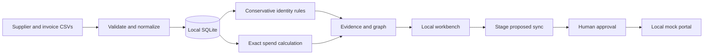

# Outcome Engine

**Supplier intelligence with evidence and approved actions.**

The first working module of an enterprise data-to-outcome framework. Import supplier and invoice CSVs, inspect proposed supplier groups, calculate exact spend by currency, and stage an approved update to a local mock procurement portal.

Built for a laptop with Python 3.10+. No GPU, API key, cloud account, or runtime package installation is required. This is a deterministic software prototype, with a baseline for evaluating future AI components; it does not contain a trained LLM.

## Try it in two minutes

```sh
git clone https://github.com/vishalk2712/enterprise-ai-execution-framework.git
cd enterprise-ai-execution-framework
python -m enterprise_ai serve --demo
```

On Windows, use `py` instead of `python` if that is your installed Python launcher. Open **http://127.0.0.1:8765**. Stop with Ctrl+C.

1. Inspect the sample's 10 supplier records and 6 proposed entities.
2. Ask “What is our total spend by currency?” and inspect the source citations.
3. Stage a supplier sync, inspect the payload, approve it, then execute locally.
4. Open the mock portal to verify the change, or export a Markdown handover report.

The synthetic sample has 12 invoice rows: one exact duplicate is excluded, leaving 11 invoices. Expected net totals are **GBP 2,950.00 · EUR 1,250.00 · USD 1,500.00**. Currencies are never added together.

`--demo` replaces the imported dataset in the selected database. Use a separate database for experiments:

```sh
python -m enterprise_ai --db .outcome/experiment.sqlite serve --demo
```

## What works today

| Step | Implemented behavior |
|---|---|
| Import | Strict CSV validation; reject conflicting invoice IDs and orphan references; retain the last valid dataset after invalid input |
| Identity | Group exact registration/tax IDs within a country only when authority IDs do not conflict; name similarity produces review candidates |
| Spend | Decimal arithmetic, credit values, exact-duplicate exclusion, totals and supplier rankings per currency |
| Evidence | Source file and physical row references, dataset hashes, supplier/invoice relationships, bounded evidence excerpts |
| Questions | Transparent rules for supported identity and spend questions; no external model calls |
| Actions | Stage → approve → execute against SQLite mock portal; dataset-bound approvals and repeat-execution protection |
| Interface | Local dashboard, graph preview, review candidates, action queue, portal view and downloadable report |

The distinguishing product hypothesis is the complete chain from **source row → identity decision → spend result → reviewed change → verified destination**. It needs customer testing; it is not a claim of proven market advantage.

## Bring your own CSVs

Use the dashboard's “Bring your own data” panel or the CLI. The complete column sets below are required, in any order. Use UTF-8 and quote values containing commas or newlines.

**suppliers.csv**

```csv
supplier_id,name,country,registration_id,tax_id,postcode
S-001,Example Parts Ltd,GB,EXAMPLE-001,,AB1 2CD
```

**spend.csv**

```csv
invoice_id,supplier_id,invoice_date,amount,currency,category,description
I-001,S-001,2026-01-15,120.50,GBP,Parts,Synthetic demonstration invoice
```

- `supplier_id` must be unique; every invoice must reference an imported supplier.
- `invoice_id` is a dataset-wide key. Combine source-system and supplier identifiers into a unique key if invoice numbers repeat across vendors.
- Country and currency fields accept two and three letters respectively; this prototype does not verify them against official registries.
- Authority identifiers are supplied assertions, not registry-verified facts. Tax groups and shared identifiers may not represent one legal entity. Review proposed groups before operational use.
- Amounts accept up to 12 whole digits and two decimal places. Negative amounts represent credits. The sample assumes consistent net spend; tax handling and currencies with other minor-unit precision are outside this version.
- Limits: 5 MB per CSV, 1,000 supplier rows, 10,000 invoice rows, and 1,000 characters per field. These are input bounds, not performance guarantees.

```sh
python -m enterprise_ai analyze --suppliers local-data/suppliers.csv --spend local-data/spend.csv
python -m enterprise_ai query "Total spend for S-001 in GBP"
python -m enterprise_ai demo --output .outcome/demo-report.md
python -m unittest discover -s tests -v
```

Use a full supplier name, source supplier ID, or canonical entity ID for supported scoped questions. This is a bounded rules interface, not general natural-language understanding. Forecasting, currency conversion, arbitrary SQL, time/category filters, and real-world supplier verification are not implemented. Do not interpret a partial evidence list as the full dataset: the answer discloses omitted evidence, and totals are computed before the evidence display budget is applied. Character counts are diagnostics, not a tokenizer measurement or demonstrated API savings.

## Architecture



- `enterprise_ai/engine.py`: validation, identity rules, query routing, evidence and action lifecycle.
- `enterprise_ai/server.py`: loopback HTTP API and static application serving.
- `enterprise_ai/static/`: accessible vanilla HTML, CSS and JavaScript; no CDN dependencies.
- `examples/`: inspectable synthetic data; packaged copies live under `enterprise_ai/data/`.
- `tests/`: acceptance, regression and HTTP checks using independently authored fixtures.

Data and action state persist in `.outcome/engine.sqlite` by default. Imports replace the active dataset and invalidate approvals tied to different data. Portal records retain their source snapshot so outdated entries can be identified. This audit history is local and editable by the machine owner; it is not an immutable enterprise audit service.

## Boundaries and next steps

This server binds to `127.0.0.1`. It has no user accounts, tenant isolation or production deployment support. Keep it local. It does not send data to an LLM, run uploaded code, control a browser, or update a real ERP. The mock approval flow demonstrates workflow state, not organizational access control.

The commercial starting point is a **reviewed supplier-cleanup and spend handover** for procurement teams. First measure false merges, unresolved cases, analyst review time and report usefulness with consenting pilot users. Keep sensitive customer data out of the public repository; `local-data/`, `.outcome/`, secrets and databases are ignored.

The next model should earn its place by beating this baseline on held-out, permissioned examples. A small classifier for ambiguous matches or intent routing may be more useful than training a general chatbot. MiniMind training, graph retrieval, and one bounded browser/API adapter are later experiments, not installed dependencies or promised savings.

- [Detailed concept review and source verification](docs/idea-review.md)
- [Phased roadmap and release gates](docs/roadmap.md)
- [Evaluation methodology](docs/evaluation.md)

## Attribution

This implementation is original code using Python's standard library and browser platform APIs. The concept review links the upstream projects that informed the design. No code, model weights, skills, or datasets from MiniMind, MiroFish, Graphify, OpenViking, Roo Code or Jev are bundled. Those projects retain their own licenses; adopting them later requires a separate compatibility review.

Released under the [MIT License](LICENSE).
