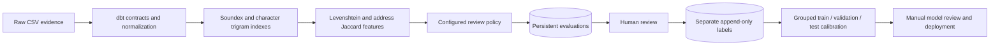

# Entity resolution v0.2

The local engine now separates candidate retrieval, feature calculation, policy decisions, and human labels. No LLM or GPU is needed. This is an enterprise deployment foundation, not a production identity service.

## Data flow



The lightweight `demo` and `analyze` commands keep Python validation. Use `pipeline` or `serve --require-dbt` to require the real dbt gate. A failed gate never enters matching or replaces the active dataset.

## Candidate generation and scoring

`normalization.py` implements Unicode name normalization, common legal-suffix removal and English Soundex. `matching.py` builds inverted Soundex and character N-gram indexes over names and optional pipe-separated aliases. Country is now a feature, not a candidate blocking rule. Aliases expand retrieval; they are not independently verified identity evidence.

Default bounds: trigrams, two shared grams or a Soundex match, skip postings above 150 records, retain 40 outgoing neighbors per record, reject runs above 50,000 unique candidates. The union can give a record more than 40 incoming neighbors. Skipped postings and capped records are counted in run statistics. Soundex is English-oriented; Unicode N-grams remain available for other names. Names and addresses are limited to 256 characters for feature calculation, with truncation recorded.

Score = weighted mean of available name Levenshtein similarity (0.70), address token Jaccard (0.20), and exact postcode (0.10). Missing address/postcode contributes neither agreement nor disagreement. Country agreement and authority-ID conflicts are separately recorded and affect review policy. A score at least 0.88 is a review candidate; conflicting IDs or countries require conflict review. Fuzzy scores never merge entities. Existing conservative authority grouping remains separate.

**A weighted similarity is not a probability.** Default `match_probability` is null. An explicitly supplied, domain/configuration-matched calibration artifact produces a probability estimate; no supplier calibration is shipped. Thresholds and weights are starting values, not optimized or validated production policies.

## Persistent audit contract

| Table | Purpose and keys |
|---|---|
| `resolution_runs` | Unique run ID, immutable source `snapshot_id`, exact canonical matching configuration and hash, statistics, dbt manifest and optional calibration artifact |
| `pair_evaluations` | Unique `evaluation_id`, run reference, ordered pair, immutable `algorithmic_outcome`, score, all feature values, original source records, retrieval methods, sampling probability |
| `review_decisions` | Separate verified `human_label` (`Match`, `NonMatch`, `Unsure`), reviewer, reason, timestamp, optional `supersedes` reference |

Repeated imports create new runs and keep earlier evaluations/labels. Source snapshot hashes identify identical CSV inputs; the effective action snapshot also includes matching configuration, dbt manifest and calibration so approvals cannot silently transfer across policy changes. Reviews use optimistic concurrency: amendments must identify the current decision. Database triggers prevent updates/deletes through ordinary SQL. A machine owner can change the database or triggers; this is not tamper-proof enterprise storage. Reviewer names are self-declared until an identity provider is integrated. Older v0.1 evaluations cannot be reconstructed retrospectively.

All generated candidates are evaluated and retained, including **100% of evaluated scores in [0.80, 0.88)**. This does not claim coverage of ungenerated near-misses. A seeded, uniform reservoir of up to 100 excluded pairs sharing a normalized tax ID is additionally evaluated. Its population size and inclusion probability are recorded. Dense shared-tax groups still require enumerating that group's pairs; retention is bounded, not total diagnostic computation. These samples are a biased diagnostic stratum, never automatic Match/NonMatch labels. An excluded pair already grouped by authority retains `Excluded_Sampled` plus an `authority_grouped` flag.

The current laptop limits are 1,000 suppliers and 10,000 invoice rows. Audit records contain supplied data; keep exports and contract work directories within the intended data boundary.

## Review and calibration loop

The dashboard's **Resolution learning loop** lists current and previous runs. Inspect original records and features, then append a label with reviewer and reason. Labeling does not execute a merge or portal action.

```sh
python -m enterprise_ai audit-export --output .outcome/audit.jsonl
python -m enterprise_ai labels-export --output .outcome/labels.jsonl
python -m enterprise_ai review EVALUATION_ID Match --reviewer Analyst --reason "Verified against source evidence"
```

Before calibration, deduplicate repeated pairs across runs, adjudicate conflicting reviews, assign both endpoints' connected entity groups to `entity_group_ids`, and assign `split` (`train`, `validation`, `test`). The export deliberately leaves those fields unassigned. No entity group may cross partitions. Use independently verified labels representing the intended deployment population, including negatives beyond the diagnostic shared-tax stratum.

```sh
python -m enterprise_ai calibrate --labels .outcome/labeled-splits.jsonl --domain supplier --output .outcome/calibration.json
python -m enterprise_ai --calibration .outcome/calibration.json serve
```

The calibrator fits a logistic mapping of the fixed weighted score on training data, selects regularization by validation Brier score, and evaluates the test split once. It records Brier score, reliability bins and expected calibration error. The ten-row/two-class minimum per partition is a validity check, not a statistically sufficient sample size. Entity grouping quality, label quality, sample bias and drift still require human evaluation. The artifact must match the exact configuration and `supplier` domain. Person/restaurant benchmark results do not authorize supplier deployment.

## dbt gate

```sh
python -m venv .venv
# Activate the environment for your shell, then:
python -m pip install -r requirements-dbt.txt
python -m enterprise_ai serve --demo --require-dbt
python -m enterprise_ai pipeline --suppliers examples/suppliers.csv --spend examples/spend.csv --output-dir .outcome/batches
```

Pinned dbt Core 1.10.15, dbt-duckdb 1.10.1 and DuckDB 1.4.1 run packaged SQL models and tests. Models trim/collapse whitespace and normalize country/currency case. Tests check unique supplier keys, required values, supplier references, date/money formats, country/currency lengths, and conflicting invoice IDs. Exact duplicate invoices remain allowed at intake and are excluded with a warning by the accounting layer. The matching core consumes staged supplier values while preserving raw source evidence. The staged spend model is validated; exact accounting still consumes original CSV values through Python's decimal/date validation.

Batch outputs have a unique directory and a `manifest.json` written last. Failed batches have no completion manifest; dbt evidence remains available for diagnosis. `--without-dbt` is an explicit lightweight mode and its manifest discloses that status.

## Deployment boundary

See [enterprise deployment](enterprise-deployment.md) and [benchmark results](benchmark-results.md). Production work still needs authenticated reviewers, role-based approvals, tenancy, managed append-only audit storage, retention policies, representative supplier validation, load testing and an operational destination connector. Local mock actions remain the only execution target.
